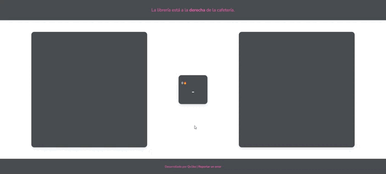

# iod

Minijuego educativo para enseñar y practicar la diferenciación entre izquierda y derecha.

## Uso

1. Descarga el repositorio y descomprímelo o clónalo.
2. Accede a la carpeta del repositorio y abre el archivo .html en tu navegador.
